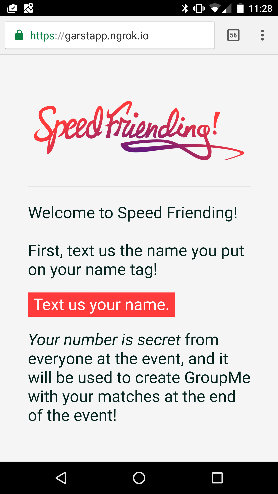
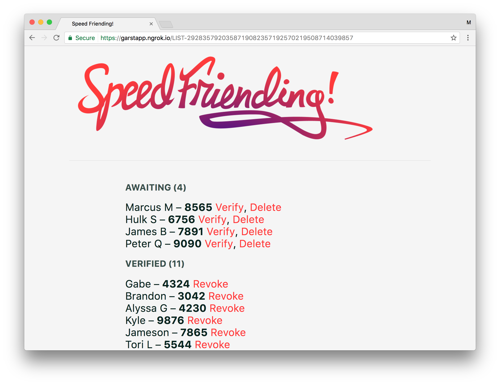
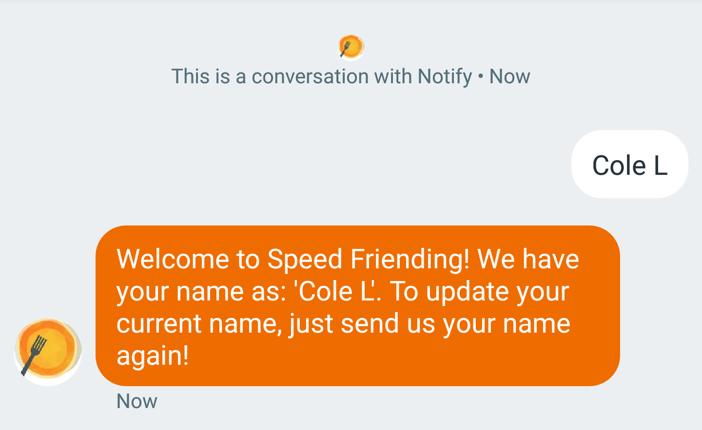
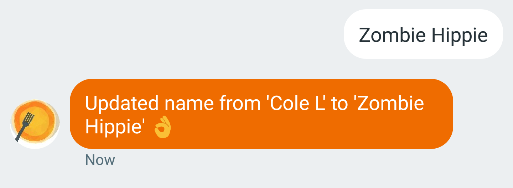
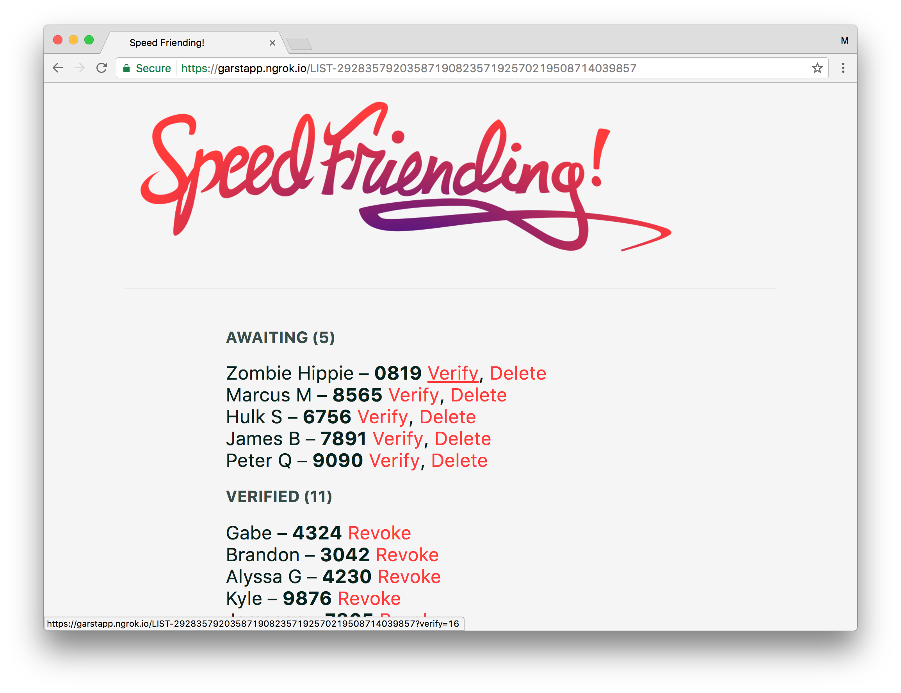
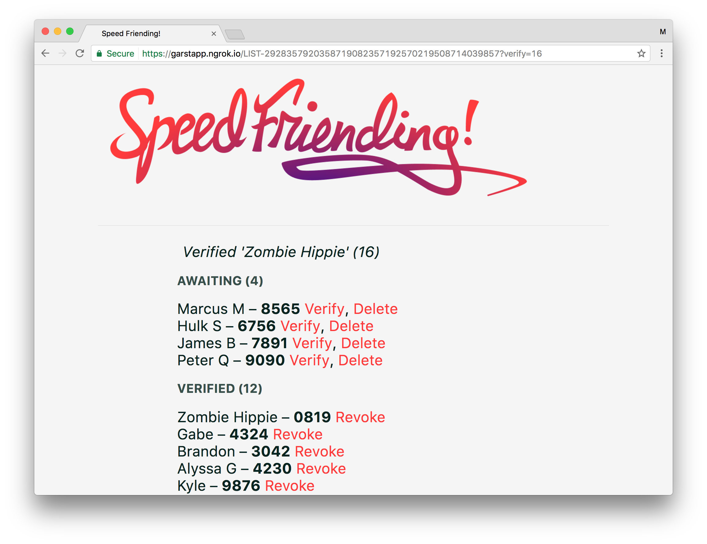
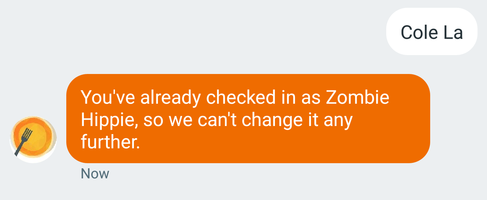
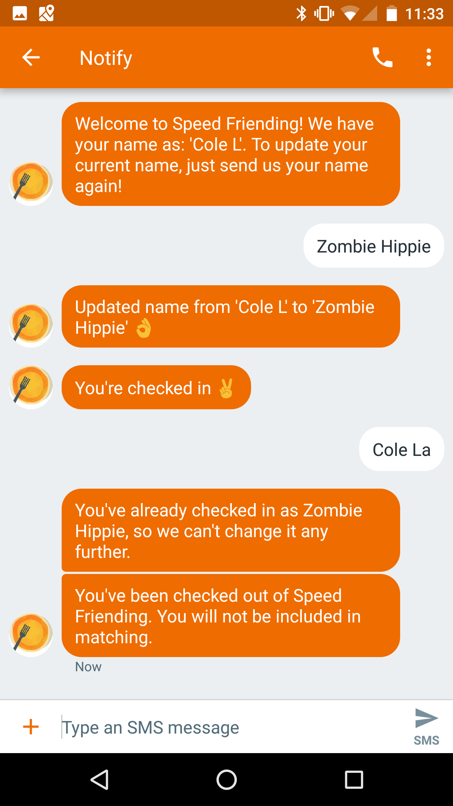
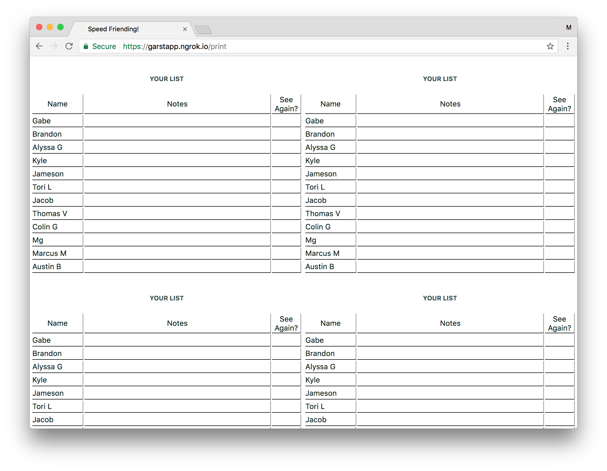
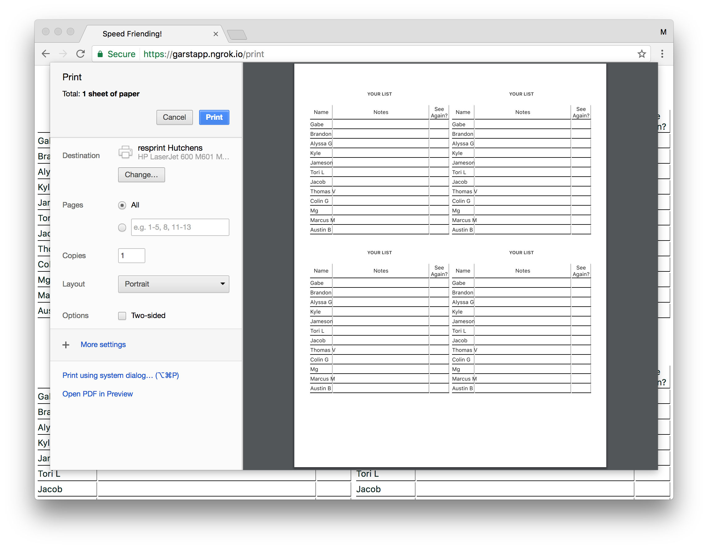

# Speed Friending SMS

A phone validator and RSVP list maker.

The Speed Friending event was another idea put on by Covalent to see how open students would be to meeting others in a sort of Speed Dating-like atmosphere.

After the event, we take everyones' match cards, and use the GroupMe API to create groups between students who both wanted to meet up again. We could use their phone number to identify them, and use GroupMe to keep their personal information private from each other. GroupMe is the predominate tool for group projects on campus, so it was a low risk endeavor for students.

This is an entirely analog event which puts people in front of each other, and this project repo hosts the tools we needed to validate phone numbers and print out match sheets just before the event.

## Screenshots

### Checking in, changing name, removing from event.

| Attendee Interface | Admin Interface |
| ------------- | ------------- |
| Homepage from mobile view.   | **Admin**, initial list.  |
| **Mobile**, starting conversation.  |  |
| **Mobile**, sent name.  | **Admin**, see new name.  |
| **Mobile**, update name to "Zombie Hippie".  | **Admin**, see change in name.  |
|  | **Admin**, verify name (check number in).  |
| **Mobile**, see checked in.  |  |
| **Mobile**, attempt change name.  |  |
|  | **Clicked `Revoke` next to "Zombie Hippie"** |
| **Mobile**, see revoked result name.  |  |
| **Mobile**, conversation summary.  | |

### Printing list of checked in attendees

**Admin**, print list of verified/checked in friends. 

**Admin**, print list preview of verified/checked in friends. 

## Setup

To start your Phoenix app:

  * Install dependencies with `mix deps.get`
  * Create and migrate your database with `mix ecto.create && mix ecto.migrate`
  * Write your `.env` file for tokens for Twilio
  * Start Phoenix endpoint with `source ./dev.sh`

Now you can visit [`localhost:4000`](http://localhost:4000) from your browser.

Ready to run in production? Please [check our deployment guides](http://www.phoenixframework.org/docs/deployment).

## Environment Variables

### `.env` file

It is recommended to hold a `.env` file in your working directory to configure the server for
development. An example `.env` file may contain the following lines of shell code to set up
environment variables.

```shell
# Your SMTP Username
export GA_SMTP_USERNAME=AWFAWF15WIOPJ094U2P330
# Your SMTP Password
export GA_SMTP_PASSWORD=AgawZA1G3455235+HRGx7123xikxI/paM125s1O
# Your SMTP Server name
export GA_SMTP_SERVER_NAME=email-smtp.us-west-2.amazonaws.com
# Your SMTP Port
export GA_SMTP_SERVER_PORT=465

# Sending Email addresses
# May be no-reply addresses
export GA_SEND_VERIFY_FROM=verify@notify.garstapp.com
export GA_SEND_NOTIFY_FROM=notify@notify.garstapp.com

# Your Twilio Account SID
export GA_TWILIO_ACCOUNT_SID=BF55cc277dac99096c1239102cd4160006
# Your Twilio auth token
export GA_TWILIO_AUTH_TOKEN=2078090060440e929188c2b5a5b7fa76
# The number in your Twilio acct you wish to send texts from
export GA_TWILIO_SEND_NUMBER=+15556667777

# This is the HTTP Basic Auth Header we can use to circumvent
# the Twilio signing process. Leaving this empty "" will disable this.
# So, in whatever dev environment we have, we may have POST Webhook to:
# https://@garstapp.com/hook/sms
export GA_TWILIO_HTTP_BASIC_AUTH=twilio:superhardpassword

```

## References

The developer of this repository refers to prior https://github.com/CovalentLabs/garst_app_signup

## Learn more

  * Official website: http://www.phoenixframework.org/
  * Guides: http://phoenixframework.org/docs/overview
  * Docs: https://hexdocs.pm/phoenix
  * Mailing list: http://groups.google.com/group/phoenix-talk
  * Source: https://github.com/phoenixframework/phoenix
